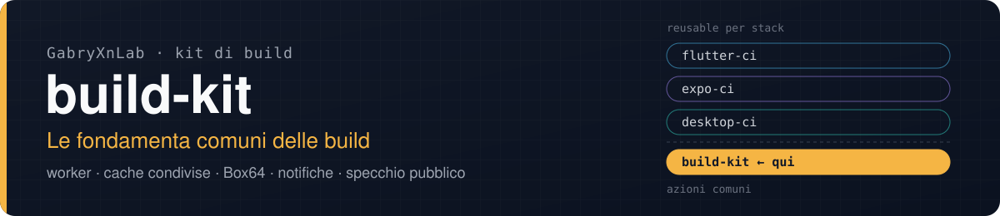
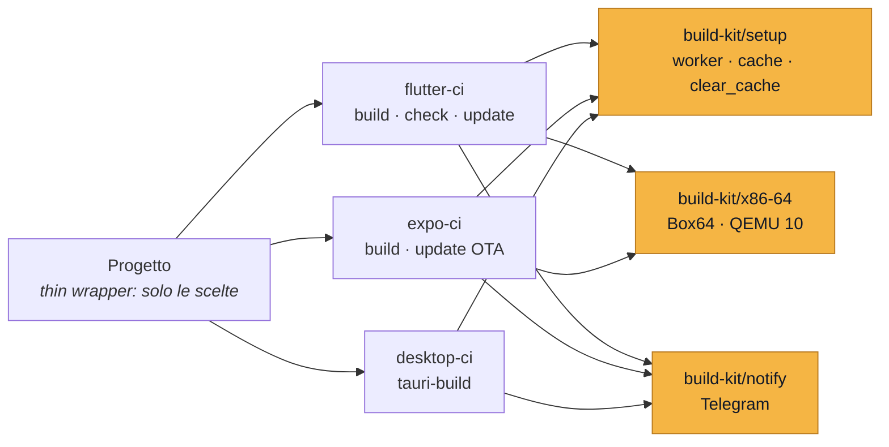
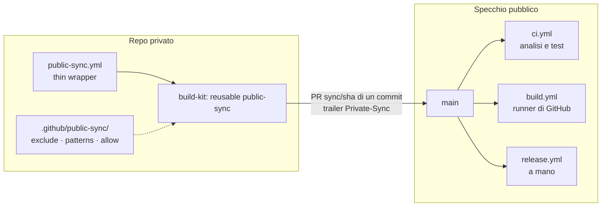

<p align="center">
  
</p>

<p align="center">
  <a href="https://github.com/GabryXnLab/flutter-ci">flutter-ci</a> ·
  <a href="https://github.com/GabryXnLab/expo-ci">expo-ci</a> ·
  <a href="https://github.com/GabryXnLab/desktop-ci">desktop-ci</a> ·
  <a href="https://github.com/GabryXnLab/build-kit"><b>build-kit</b></a>
</p>

<p align="center">
  
  
  
  <a href="LICENSE"></a>
  <a href="https://github.com/GabryXnLab/build-kit/commits/main"></a>
</p>

**I pezzi che ogni build ha in comune (quanti worker usare, quali cache condividere, come eseguire un binario x86-64 su ARM64, come avvisare dell'esito), scritti una volta sola e usati da tutti i reusable della famiglia. Più il sistema che pubblica un repo privato nel suo specchio pubblico senza farne uscire la storia né i segreti.**

[Perché](#perché) · [Avvio rapido](#avvio-rapido) · [Cosa c'è](#cosa-cè) · [Riferimento](#riferimento) · [Specchio pubblico](#specchio-pubblico-public-sync) · [Architettura](#architettura) · [Fuori dall'org](#usarlo-fuori-dallorg) · [Manutenzione](#per-chi-lo-mantiene)

## Perché

- **Binari x86-64 su ARM64 con Box64, quasi 7 volte più veloce di QEMU.** Il `gen_snapshot` di Flutter gira in **46 s contro 316 s** sotto QEMU 10, l'`hermesc` di React Native in **43 s contro 95 s**. L'output è **identico byte per byte**, confrontato su due `app.dill` e su un bundle JS da 9 MB. Se Box64 esce con errore, il lanciatore rifà lo stesso comando con QEMU 10: la build rallenta ma non fallisce.
- **Provato sotto carico, non a macchina libera.** Box64 ha delle corse fra thread che si vedono solo con la CPU contesa: per questo è fissato alla release v0.4.4 e mai al master, e `flutter-ci` accetta un `gen_snapshot` solo se **due esecuzioni in parallelo riescono e danno lo stesso file**.
- **Le cache condivise non le distrugge nessuno.** Gradle, pub, lo store di pnpm, ccache e sccache servono a tutti i progetti della macchina. `clear_cache` le rende *non fidate per quel run* (build cache di Gradle spenta, ccache e sccache in `RECACHE`) e cancella solo le cartelle del progetto: una build «pulita» non costa più la build seguente a tutti gli altri.
- **Cache che valgono fra progetti e fra runner.** ccache lavora con `CCACHE_BASEDIR=$HOME`, quindi un oggetto compilato nel checkout di un runner vale anche per l'altro runner e per un altro progetto con la stessa dipendenza. sccache fa lo stesso per le dipendenze Rust.
- **Worker `auto` sulle CPU libere.** Sul self-hosted prende le CPU libere in quel momento (CPU meno il carico, mai sotto 2), su GitHub tutte. Arriva a Gradle (`GRADLE_OPTS -D`, che prevale sulla configurazione della macchina solo per quel run), a cargo e a CMake.
- **Stessi input ovunque.** `runner`, `max_workers` e `clear_cache` hanno nome, valori e significato identici in `flutter-ci`, `expo-ci` e `desktop-ci`, perché li interpreta tutti questa stessa azione.
- **Esito su Telegram con l'artefatto allegato.** Un messaggio «in corso» con il pulsante Annulla, riscritto con l'esito a fine job: se il job riesce ci sono i file (fino a 50 MB, o circa 2 GB con un Local Bot API Server), altrimenti i pulsanti per rilanciare. Non fa mai fallire il job, e senza secret tace.
- **Specchio pubblico senza fughe.** `public-sync` porta `main` di un repo privato nello specchio pubblico come PR di **un commit solo**, dopo uno scanner anti-fuga che controlla ogni file, il messaggio e la descrizione. La storia privata non esce mai.
- **Zero dipendenze.** Bash con `set -euo pipefail` e `python3` di sola libreria standard: niente da installare, niente da compilare.

## Avvio rapido

Nel job di un workflow, prima della build:

```yaml
steps:
  - uses: actions/checkout@v4

  - id: tune
    uses: GabryXnLab/build-kit/setup@main
    with:
      runner: github            # self-hosted | github
      max_workers: auto         # auto | 2 | 4 | un numero
      clear_cache: 'false'

  - run: ./gradlew assembleRelease   # legge GRADLE_OPTS scritto da setup
```

La notifica di inizio e d'esito, facoltativa (senza secret non manda niente):

```yaml
  - id: started
    uses: GabryXnLab/build-kit/notify@main
    with:
      bot_token: ${{ secrets.TELEGRAM_BOT_TOKEN }}
      chat_id: ${{ secrets.TELEGRAM_CHAT_ID }}
      topic_id: '<id del topic>'
      status: started
      title: App android release
  # … la build …
  - if: ${{ always() }}
    uses: GabryXnLab/build-kit/notify@main
    with:
      message_id: ${{ steps.started.outputs.message_id }}   # riscrive lo stesso messaggio
      bot_token: ${{ secrets.TELEGRAM_BOT_TOKEN }}
      chat_id: ${{ secrets.TELEGRAM_CHAT_ID }}
      topic_id: '<id del topic>'
      status: ${{ job.status }}
      title: App android release
      files: build/app/outputs/flutter-apk/*.apk              # un modello per riga
```

Per una build Flutter, Expo o Tauri completa non servono queste azioni una per una: usa il reusable dello stack ([flutter-ci](https://github.com/GabryXnLab/flutter-ci), [expo-ci](https://github.com/GabryXnLab/expo-ci), [desktop-ci](https://github.com/GabryXnLab/desktop-ci)), che le chiama già.

## Cosa c'è

| Componente | Tipo | Cosa fa |
| :--- | :--- | :--- |
| [`setup`](setup/action.yml) | azione | worker, cache condivise della macchina, `clear_cache` di sola esecuzione |
| [`x86-64`](x86-64/action.yml) | azione | lanciatore per binari x86-64 sul runner ARM64: Box64, con QEMU 10 di riserva |
| [`notify`](notify/action.yml) | azione | inizio ed esito su Telegram, con gli artefatti allegati |
| [`public-sync`](public-sync/action.yml) + [reusable](.github/workflows/public-sync.yml) | azione + reusable | specchio pubblico di un repo privato, con scanner anti-fuga |
| [`templates/publish/`](templates/publish/) | template | wrapper del sync e build/release dello specchio per Flutter, Tauri ed Expo |
| [`bin/ci-batch`](bin/ci-batch) | script | lancia in un colpo le build di più progetti dell'org |

## Riferimento

### `setup`: worker e cache

<details>
<summary>Input, output e variabili scritte</summary>

| Input | Default | |
| :--- | :--- | :--- |
| `runner` | `self-hosted` | `self-hosted` \| `github`. Sul self-hosted accende le cache condivise della macchina |
| `max_workers` | `auto` | `auto` = sul self-hosted le CPU libere (CPU meno il carico, mai sotto 2), su GitHub tutte \| un numero |
| `clear_cache` | `false` | `true` = per questo run niente risultati dalle cache; le cache condivise non si cancellano mai |
| `rust` | `false` | `true` = sccache condiviso e cartella target di cargo fuori dal checkout (solo self-hosted) |
| `cargo_target_key` | `''` | nome della cartella target sotto `~/ci/cache/cargo-target`; vuoto = nome del repo |

Output: `workers` (i worker scelti), `cargo_target_dir` (vuota se cargo resta nel checkout).

Scrive in `GITHUB_ENV`:

| Variabile | Quando | Perché |
| :--- | :--- | :--- |
| `GRADLE_OPTS` | sempre: `-Dorg.gradle.workers.max=N -Dorg.gradle.parallel=true`, più `-Dorg.gradle.caching=false` con `clear_cache` | prevale su `~/.gradle/gradle.properties` della macchina, solo per il run |
| `CARGO_BUILD_JOBS`, `CMAKE_BUILD_PARALLEL_LEVEL` | sempre: `N` | stessi worker per cargo e CMake |
| `NDK_CCACHE`, `CCACHE_BASEDIR=$HOME`, `CCACHE_NOHASHDIR` | self-hosted | il C/C++ dell'NDK passa da ccache, riusabile fra runner e progetti |
| `RUSTC_WRAPPER=sccache`, `SCCACHE_DIR`, `SCCACHE_CACHE_SIZE`, `CARGO_TARGET_DIR`, `CARGO_INCREMENTAL=0` | self-hosted con `rust` | dipendenze Rust compilate una volta per tutti; target fuori dal checkout |
| `CCACHE_RECACHE`, `SCCACHE_RECACHE` | con `clear_cache` | ricompila senza fidarsi della cache, e la riscrive |

Il riepilogo del run riporta CPU, carico, worker scelti, RAM libera e se le cache erano fidate. sccache (v0.18.0, SHA-256 verificato) si scarica da solo la prima volta.

</details>

### `x86-64`: binari x86-64 sul runner ARM64

```yaml
- id: x86
  uses: GabryXnLab/build-kit/x86-64@main
  with:
    emulator: box64        # box64 | qemu
- run: ${{ steps.x86.outputs.launcher }} ./strumento-x86-64 --argomenti
```

Su un host x86-64 `launcher` è vuoto e il comando gira nativo.

<details>
<summary>Input e output</summary>

| Input | Default | |
| :--- | :--- | :--- |
| `emulator` | `box64` | `box64` (se esce con errore il lanciatore ripete con QEMU) \| `qemu` (solo QEMU 10) |
| `box64_commit` | `2f130fab…` (release v0.4.4) | commit di Box64 da compilare se manca o è un altro; non il master |
| `qemu_deb_url` | `qemu-user` 10 di Debian trixie | pacchetto da cui estrarre QEMU (con `dpkg-deb`, senza installazioni di sistema). La 8.2 di Ubuntu 24.04 non va |
| `qemu_deb_sha256` | lo SHA-256 del default | verificato prima di estrarre; chi cambia l'URL cambia anche questo |

| Output | |
| :--- | :--- |
| `launcher` | percorso assoluto del lanciatore (vuoto su host x86-64) |
| `emulator` | `box64` \| `qemu` \| `native`: quello effettivamente in uso |
| `box64` | percorso di Box64, per chi compone un lanciatore suo (la doppia esecuzione di `flutter-ci`) |
| `qemu` | percorso di QEMU 10, sempre presente su ARM64: è il ripiego |

Tutto sta sotto `$HOME` (`~/ci/tools`, `~/qemu-x86_64-10`), senza `sudo`. Box64 si compila una volta per macchina (circa 6 minuti), con un lucchetto perché due runner non lo compilino insieme; se la compilazione fallisce si passa a QEMU con un avviso.

</details>

### `notify`: esito su Telegram

<details>
<summary>Input, output e comportamento</summary>

| Input | Default | |
| :--- | :--- | :--- |
| `bot_token` | `''` | token del bot. Vuoto = nessuna notifica, in silenzio |
| `chat_id` | `''` | chat del supergruppo (`-100…`). Vuoto = in silenzio; non un supergruppo = nessuna notifica, con un avviso |
| `topic_id` | `''` | `message_thread_id` del topic. Vuoto = nessuna notifica (mai nel General) |
| `status` | obbligatorio | `job.status` (`success` \| `failure` \| `cancelled`), oppure `started` all'inizio di un job lungo |
| `title` | obbligatorio | riga di intestazione, testo semplice |
| `details` | `''` | testo aggiuntivo, in un blocco monospaziato |
| `details_file` | `''` | file il cui contenuto si aggiunge a `details` |
| `run_inputs` | `''` | input del `workflow_dispatch` come JSON (i reusable passano `toJSON(github.event.inputs)`) |
| `message_id` | `''` | `message_id` dello step `started`: l'esito riscrive quel messaggio invece di mandarne un altro |
| `files` | `''` | un modello per riga (glob bash con `**`) dalla radice del workspace; inviati solo se il job è riuscito |

Output: `message_id` (con `status: started`).

- **Best-effort**: non fa mai fallire il job.
- Manda solo in un topic di un supergruppo, mai in privato né nel General.
- Gli artefatti partono come documenti fino a 50 MB, fino a circa 2 GB se sul runner risponde un Local Bot API Server (`TELEGRAM_API_BASE`, default `http://localhost:8081`).
- Il token arriva a `curl` da stdin e non dagli argomenti, dove chiunque sulla macchina lo leggerebbe con `ps`.
- I pulsanti (Annulla, Rilancia, Solo falliti, Senza cache, Errore, Risolvi con AI, Rimanda artefatti) sono callback per il bot che li riceve: funzionano con il bot CI dell'org, con un altro bot restano muti. Il pulsante «Log», un semplice link al run, funziona con qualsiasi bot.

</details>

## Specchio pubblico (`public-sync`)

Lo sviluppo sta in un repo privato, il pubblico riceve le modifiche come PR preparate dal privato.

- **Un commit per PR, mai la storia privata.** A ogni push su `main` del privato si costruisce l'albero di `main` meno i percorsi esclusi, e se ne fa un commit il cui unico genitore è `main` del pubblico, sul branch `sync/<sha corto>`. Una PR nuova chiude quella ancora aperta.
- **Il trailer `Private-Sync: <sha>`** dice qual è l'ultimo commit privato arrivato; merge, squash e rebase vanno bene tutti.
- **Lo scanner blocca le fughe** su ogni file, sul messaggio e sulla descrizione. Il rapporto dice file, riga e id del modello, mai il valore trovato. I modelli sono su tre livelli, sommati: quelli generici del kit ([`public-sync/patterns`](public-sync/patterns): token, chiavi private, keystore, configurazioni Firebase), quelli del progetto e quelli personali nel secret `PUBLIC_SYNC_PATTERNS`, che non stanno in nessun repo.
- **Un commit fatto direttamente nel pubblico non si perde.** Se la PR lo cancellerebbe, il sync si ferma, carica la patch come artefatto e apre una issue nel privato.

Il wrapper da copiare nel privato è [`templates/publish/public-sync.yml`](templates/publish/public-sync.yml):

```yaml
jobs:
  sync:
    uses: GabryXnLab/build-kit/.github/workflows/public-sync.yml@main
    with:
      app_name: App
      public_repo: <owner>/<pubblico>
      baseline: <sha del commit privato da cui è nato il pubblico>
      require_extra_patterns: true
      dry_run: ${{ inputs.dry_run == true }}
    secrets:
      PUBLIC_SYNC_TOKEN: ${{ secrets.PUBLIC_SYNC_TOKEN }}        # PAT sul solo pubblico
      PUBLIC_SYNC_PATTERNS: ${{ secrets.PUBLIC_SYNC_PATTERNS }}  # modelli personali
      TELEGRAM_BOT_TOKEN: ${{ secrets.TELEGRAM_BOT_TOKEN }}
      TELEGRAM_CHAT_ID: ${{ secrets.TELEGRAM_CHAT_ID }}
```

La configurazione del progetto sta in `.github/public-sync/`: `exclude` (obbligatorio), `patterns` e `allow`. Gli esempi commentati sono in [`templates/publish/public-sync/`](templates/publish/public-sync/).

<details>
<summary>Input, secret e output del reusable</summary>

| Input | Default | |
| :--- | :--- | :--- |
| `app_name` | obbligatorio | nome del progetto, per la notifica |
| `public_repo` | obbligatorio | lo specchio pubblico, `owner/nome` |
| `config_dir` | `.github/public-sync` | `exclude`, `patterns`, `allow` del progetto |
| `baseline` | `''` | commit privato il cui albero è quello del commit iniziale del pubblico; serve finché il pubblico non ha un trailer |
| `branch_prefix` | `sync/` | branch della PR nel pubblico |
| `sync_trailer` | `Private-Sync` | trailer dell'ultimo commit privato arrivato |
| `accept_trailer` | `Public-Sync-Accept` | trailer che nel privato dice che i contributi del pubblico sono stati riportati |
| `author_name` | `github-actions[bot]` | autore e committer del commit di sync |
| `author_email` | l'indirizzo noreply di `github-actions[bot]` | |
| `require_extra_patterns` | `false` | fallisce se `PUBLIC_SYNC_PATTERNS` è vuoto, invece di pubblicare senza quei controlli |
| `dry_run` | `false` | calcola commit, scanner e contributi del pubblico e li mostra nel riepilogo, senza push, PR né issue |
| `runs_on` | `["self-hosted", "nexus-core"]` | etichette del runner, come JSON (il default è il runner self-hosted dell'org) |
| `telegram_topic_id` | `'6'` | topic della notifica; vuoto = nessuna notifica |

| Secret | |
| :--- | :--- |
| `PUBLIC_SYNC_TOKEN` | PAT fine-grained sul solo repo pubblico: Contents, Pull requests e Workflows in lettura e scrittura (senza Workflows GitHub rifiuta ogni sync che tocca `.github/workflows/`) |
| `PUBLIC_SYNC_PATTERNS` | modelli dello scanner in più, nel formato di `patterns` |
| `TELEGRAM_BOT_TOKEN`, `TELEGRAM_CHAT_ID` | facoltativi, per la notifica |

| Output | |
| :--- | :--- |
| `result` | `noop` \| `ready` \| `pr-up-to-date` \| `blocked-public` (contributi del pubblico: patch nell'artefatto `public-sync` e una issue nel privato) \| `blocked-leak` |
| `pr_url` | la PR aperta o aggiornata |

Il job gira solo in un repo privato (`if: github.event.repository.private`), con la configurazione globale di git disattivata: il pubblico si tocca solo con `PUBLIC_SYNC_TOKEN`, mai col `GITHUB_TOKEN`, che serve solo per la issue nel privato.

</details>

<details>
<summary>Lo script in locale</summary>

In un clone del privato, con `main` del pubblico in `refs/public/main` (lo script crea solo oggetti e un ref `refs/public-sync-out/…`):

```bash
git fetch https://github.com/<owner>/<pubblico>.git '+refs/heads/main:refs/public/main'
python3 public-sync/sync.py plan --dry-run --baseline <sha> --extra-patterns <file> --out-dir /tmp/x
python3 public-sync/sync.py scan HEAD --extra-patterns <file>
python3 -B -m unittest public-sync/test_sync.py      # le prove, su repo git finti
```

</details>

<details>
<summary>Template per lo specchio: build e release</summary>

In [`templates/publish/`](templates/publish/), da copiare nel privato (il sync li porta nel pubblico) sostituendo i segnaposto `<…>`. Nel pubblico build e release girano sui runner di GitHub.

| Stack | File | Cosa fa |
| :--- | :--- | :--- |
| Flutter | [`flutter/ci.yml`](templates/publish/flutter/ci.yml) | analisi e test, autonomo: funziona in ogni fork |
| Flutter | [`flutter/build.yml`](templates/publish/flutter/build.yml) | a ogni merge: APK per architettura, universale e IPA non firmato, su `flutter-ci` |
| Flutter | [`flutter/release.yml`](templates/publish/flutter/release.yml) | a mano: versione da `pubspec.yaml`, rifiuto di un APK firmato con chiave di debug, SHA-256 di tutti i file |
| Tauri | [`desktop/build.yml`](templates/publish/desktop/build.yml), [`desktop/release.yml`](templates/publish/desktop/release.yml) | bundle di ogni merge e release, su `desktop-ci` con `runner_type: github` |
| Expo | [`expo/build.yml`](templates/publish/expo/build.yml) | build su EAS, a mano: nel pubblico il self-hosted non c'è |

La checklist per pubblicare un progetto nuovo (scanner in locale, commit iniziale senza storia, secret, prova a secco, prima PR) è in [`CLAUDE.md`](CLAUDE.md#checklist-per-un-progetto-nuovo).

</details>

## Architettura



Il progetto contiene solo un thin wrapper (`workflow_dispatch`, input di scelta, `run-name` con le scelte, secret passati per nome); la logica dello stack sta nel suo `<stack>-ci`, e ciò che è comune a tutti gli stack sta qui. Una miglioria nasce nel reusable o qui, mai in un wrapper.



## Usarlo fuori dall'org

Il repo è pubblico e chiunque può chiamarne le azioni. Cosa funziona per chi non è dell'org:

| Componente | Su un runner GitHub | Note |
| :--- | :--- | :--- |
| `setup` | sì | con `runner: github` scrive solo variabili d'ambiente; il ramo `self-hosted` presuppone le cache e le cartelle della macchina dell'org |
| `x86-64` | sì (non fa niente su x86-64) | su un tuo runner ARM64 Linux funziona: installa tutto sotto `$HOME`, senza `sudo`, ma per compilare Box64 servono `git`, `cmake` e un compilatore C |
| `notify` | sì, con il tuo bot e il tuo supergruppo | i pulsanti con callback restano muti: li gestisce il bot dell'org |
| `public-sync` | sì, passando `runs_on: '["ubuntu-latest"]'` | il default `runs_on` è il runner self-hosted dell'org: senza quel runner il job resta in coda. Passa anche `telegram_topic_id: ''` se non hai un topic |
| `bin/ci-batch` | no | la tabella `TARGETS` elenca i progetti dell'org |

**Fissa una versione.** `@main` cambia per tutti a ogni push. Da fuori conviene uno SHA:

```yaml
- uses: GabryXnLab/build-kit/setup@<sha di un commit>
```

Il reusable `public-sync` chiama a sua volta `build-kit/public-sync@main` e `build-kit/notify@main`: fissarlo a uno SHA fissa il workflow, non le azioni che usa. Per fissare tutto, fai un fork.

## Per chi lo mantiene

- **`@main` è live per tutti**: i tre reusable usano `build-kit/…@main`. Input nuovi con default, mai rinominati né tolti senza aggiornare i chiamanti.
- **Il repo deve restare pubblico**: GitHub risolve ogni `uses:` all'avvio del job, anche quello di uno step che non girerà, e un repo pubblico non può usare azioni di repo privati. Qui non c'è niente di segreto: token, chat e chiavi arrivano sempre dal chiamante.
- **Cache condivise della macchina** (sul runner self-hosted dell'org, due istanze sulla stessa macchina):

  | Cosa | Dove | Condiviso fra |
  | :--- | :--- | :--- |
  | Gradle: dipendenze, trasformazioni, build cache | `~/.gradle` | tutti i progetti Gradle, entrambi i runner |
  | pub | `~/.pub-cache` | progetti Flutter |
  | pnpm | `~/.local/share/pnpm/store` | progetti Node |
  | ccache | `~/.cache/ccache` (10 GB) | NDK di tutti i progetti |
  | sccache | `~/.cache/sccache` (10 GB) | Rust di tutti i progetti |
  | target di cargo | `~/ci/cache/cargo-target/<repo>` | workflow dello stesso repo |
  | Box64, sccache, lanciatori | `~/ci/tools` | — |

- **Più build in un colpo**: `bin/ci-batch --list`, `bin/ci-batch kagami riftgate-mobile`, `bin/ci-batch -f max_workers=2 kagami@feature-x`. Ogni build va sul primo runner libero; un progetto nuovo si aggiunge alla tabella `TARGETS`.
- **Controlli prima di un push**:

  ```bash
  python3 -c "import yaml,glob; [yaml.safe_load(open(f)) for f in glob.glob('*/action.yml')]"
  bash -n bin/ci-batch && bin/ci-batch --list
  bash -n notify/notify.sh && shellcheck notify/notify.sh
  python3 -m py_compile public-sync/sync.py && python3 -B -m unittest public-sync/test_sync.py
  ```

- Le misure, i vincoli e il modello da seguire per scrivere una build nuova sono in [`CLAUDE.md`](CLAUDE.md).

## Licenza

Distribuito con licenza [Apache 2.0](LICENSE): si può usare, copiare e adattare, anche in progetti commerciali, mantenendo l'avviso di licenza e segnalando i file modificati.
